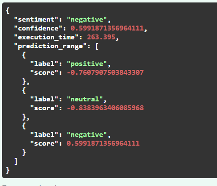
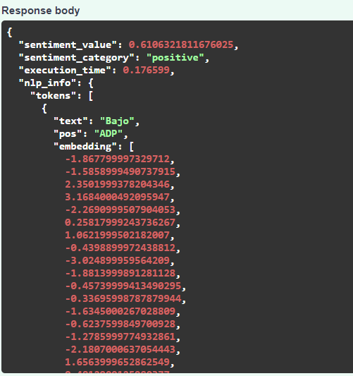
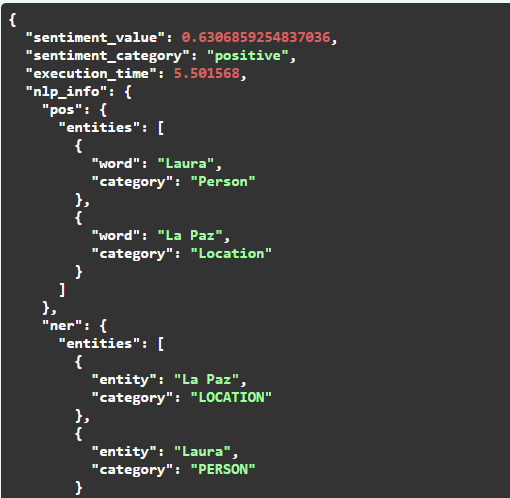
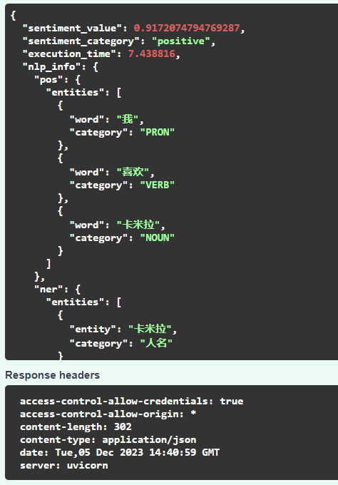
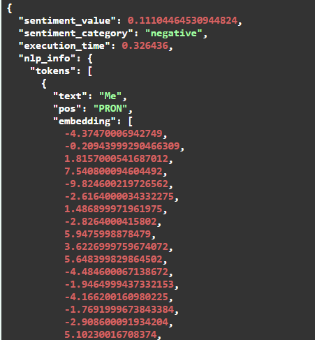
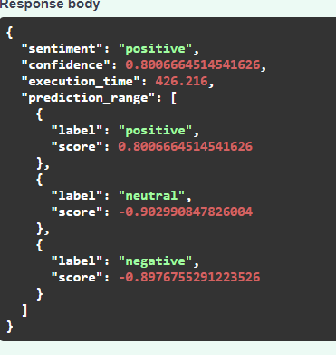
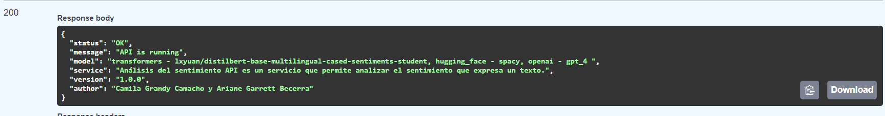

# Segundo Parcial - Tópicos Selectos en IA

### Nombres: Ariane Garrett - Camila Grandy
### Código: 54617 - 56584

El proyecto en el que trabajamos es un Análisis de Sentimiento API. Usando diferentes modelos de análisis de sentimiento
(transformers - lxyuan/distilbert-base-multilingual-cased-sentiments-student, hugging_face - spacy, openai - gpt_4)
desarrollamos una API sencilla que permite hacer peticiones para analizar el sentimiento que expresa un texto.

## Primeras configuraciones
Para iniciar el proyecto, debemos clonar el repositorio con el siguiente comando:

```bash
git clone https://github.com/arigabec/Topicos-IA-2do-Parcial-Garrett-Grandy.git
```
Una vez obtenido el proyecto completo debemos ejecutar los siguientes comandos en la rama *master*, en la carpeta donde 
clonamos el proyecto,
para poder visualizar el proyecto funcionando en un contenedor de Docker:

```bash
cd Topicos-IA-2do-Parcial-Garrett-Grandy
docker compose up
```

## Explicación de la API
La API se encuentra en el archivo main.py, y se utilizó el framework FastAPI para su desarrollo. La API cuenta con 5 endpoints:

- /status: devuelve el estado en el que se encuentra el servicio actualmente.
- /sentiment: recibe un texto y devuelve la predicción del sentimiento que expresa este texto, junto con la confidencia 
de la predicción y el tiempo de ejecución de la petición.
- /analysis: recibe un texto y devuelve la predicción del sentimiento que expresa este texto, junto con la confidencia
de la predicción, el tiempo de ejecución de la petición y la información relacionada al análisis NLP utilizando el modelo
de spacy (POS tagging, NER y Embeddings).
- /analysis_v2: recibe un texto y devuelve la predicción del sentimiento que expresa este texto, junto con la confidencia
de la predicción, el tiempo de ejecución de la petición y la información relacionada al análisis NLP utilizando el modelo
de openai (POS tagging y NER).
- /reports: devuelve un archivo .csv con los registros de las últimas predicciones realizadas.

## Explicacion de los modelos de predicción
- Transformers - lxyuan/distilbert-base-multilingual-cased-sentiments-student: utilizamos este modelo ya que nos permite
realizar un análisis más exacto sobre el sentimiento que puede expresar un texto, además que una característica importante
de este, es que permite predecir el sentimiento de los textos en diferentes idiomas (multilingue).
- Hugging_face - spacy: este modelo nos permite realizar un análisis NLP del texto enviado en la petición, devolviendo como 
resultado el POS Tagging, NER y Embeddings del texto. En este caso, utilizamos la librería "es_core_news_md", de modo que 
los textos que sean analizados deben estar en español.
- Openai - gpt_4: este modelo nos permite realizar un análisis NLP del texto enviado en la petición, devolviendo como 
resultado el POS Tagging y NER del texto. En este caso, el uso de este modelo fue interesante ya que permite predecir el
sentimiento de los textos en diferentes idiomas (multilingue).

## Ejemplos de uso de la API en Google Cloud
- /status: https://topicos-ia-2do-parcial-garrett-grandy-h6vokikroq-ue.a.run.app/docs#/default/root_status_get
- /sentiment: https://topicos-ia-2do-parcial-garrett-grandy-h6vokikroq-ue.a.run.app/docs#/default/detect_sentiment_sentiment_post
### Ejemplo de texto 
```bash
En el rincón solitario de su habitación, María se aferraba a la carta desgastada que alguna vez olió a su amor perdido. Las lágrimas se deslizaban silenciosamente por sus mejillas mientras la nostalgia invadía su corazón. El tic-tac del reloj resonaba en la quietud, recordándole que el tiempo avanzaba sin piedad. En la penumbra, susurros de recuerdos se mezclaban con el suspiro del viento que golpeaba la ventana entreabierta. Afuera, la lluvia caía como lágrimas del cielo, reflejando el lamento que su alma callaba. El eco de un adiós no pronunciado resonaba en cada rincón, dejando a María perdida en un mar de despedidas no dichas.
```
### Respuesta
 
- /analysis: https://topicos-ia-2do-parcial-garrett-grandy-h6vokikroq-ue.a.run.app/docs#/default/analyze_text_analysis_post
### Ejemplo de texto 
```bash
Bajo el sol dorado de un día radiante, Ana y Juan compartieron sonrisas y susurros en un parque lleno de promesas. Entre risas y complicidad, descubrieron que la felicidad reside en los pequeños momentos compartidos. Con el atardecer como testigo, decidieron caminar juntos hacia un futuro donde el amor tejiera cada capítulo de sus vidas.
```
### Respuesta
 
- /analysis_v2: https://topicos-ia-2do-parcial-garrett-grandy-h6vokikroq-ue.a.run.app/docs#/default/analyze_text_with_openai_analysis_v2_post
### Ejemplo de texto 
```bash

En el tranquilo rincón de La Paz, Laura se sumergió en el suave murmullo de la naturaleza que abrazaba la ciudad. Los colores suaves del amanecer pintaban el cielo mientras ella paseaba por las calles adoquinadas, sintiendo la armonía en cada paso. Rodeada de serenidad, Laura encontró en ese instante la dicha simple de estar en el momento presente, donde el silencio hablaba más alto que cualquier preocupación. En La Paz alegre, la felicidad se revelaba en la calma, y Laura abrazó ese regalo con gratitud.
```
### Respuesta
 
#Imagenes con pruebas de la API
## Ejemplo /analysis_v2 

## Ejemplo /analysis

## Ejemplo /sentiment

## Ejemplo /status

